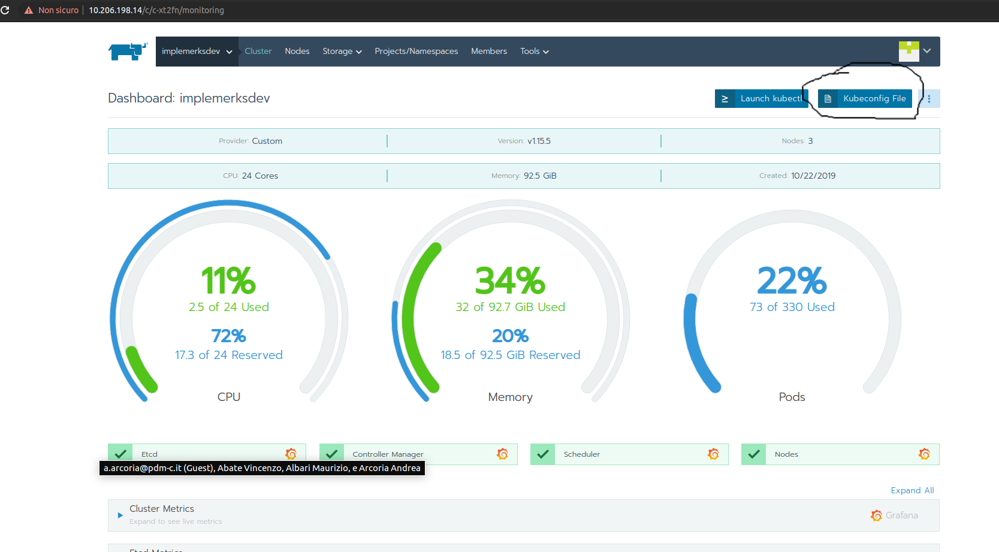

# Prenota Uffici


## Clone
>_It works only within the AlmavivA intranet (VPN aswell)_
```shell
git clone http://10.207.1.10/comune_messina/impleme/prenota-ufficio.git
```

## Run
```shell
mvn spring-boot:run
```

## Swagger
Once you started the application you can find the swagger gui at `http://localhost:8080/swagger-ui.html`
and the _swagger.json_ at `http://localhost:8080/v3/api-docs`


## Deploy (Development Environment)
>_It works only within the AlmavivA intranet (VPN aswell)_

> In order to deploy the application from your local pc via maven you need to have Kubectl installed and your file `~/.kube/config` configured. 
> 
> You can  retrive configuration from [Rancher](https://10.206.198.14/c/c-xt2fn/monitoring)
> 

> You also need to add `registry-implemedev.almaviva.it` to your docker insecure registries

Before deploy update pom version (and commit)

```shell
mvn deploy
```
 